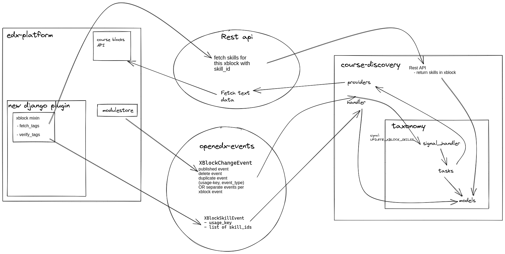

1. XBlock skill tagging design
==============================

Status
------

Provisional

Context
-------

For clients wishing to up skill their employees, edX Enterprise offers its catalog as a subscription service. Demonstrating to their clients the value of this ongoing education and what their money is buying them is one of their challenges.

edX specifically wants to demonstrate the precise capabilities their staff members are learning while taking courses on edX.org. They specifically struggle with learners who may not have finished an entire course and are unsure of the skills and topics they have truly learned.

edX wants to tag as much content as they can to achieve this. Starting off, they anticipate doing this largely automatically. They need a mechanism to keep adding tags to fresh content after they've been created, as well as a way to confirm that the machine learning that automatically labeled the content did so correctly.

Decision
--------

Build automation to perform tagging of vertical and video xblocks using third party API like Lightcast and existing functionalities in taxonomy-connector which already supports tagging of course and programme description.

Workflow
--------

Automatic tagging of xblocks
^^^^^^^^^^^^^^^^^^^^^^^^^^^^

* Create database tables to store xblock skills. `Implementation <https://github.com/openedx/taxonomy-connector/blob/8f00b139c1404695dd59ab7de27b44b410e7b730/taxonomy/models.py#L105-L223>`_.
* Create API to return text content for an XBlock using `index_dictionary <https://edx.readthedocs.io/projects/edx-installing-configuring-and-running/en/latest/configuration/edx_search.html#which-data-gets-indexed>`_ method. `API Implementation <https://github.com/openedx/edx-platform/blob/41ffd5697cb230cd71fdc3d86618a91556e8f8c1/lms/djangoapps/course_api/blocks/views.py#L342-L398>`_
* Create `xblock metadata provider <https://github.com/openedx/course-discovery/blob/1f91b31637da20431d5270d1232dcb694f39283f/course_discovery/apps/taxonomy_support/providers.py#L114-L192>`_ similar to course metadata provider which fetches text representation of the xblock from edx-platform using the API. It also combines text for each XBlock under vertical block.
* Create `tasks <https://github.com/openedx/taxonomy-connector/blob/8f00b139c1404695dd59ab7de27b44b410e7b730/taxonomy/tasks.py#L53-L92>`_ to use the xblock metadata provider to fetch text content, send it for tagging to external API(Lightcast) using existing client implementation. Also, add task for deleting xblock skills triggered in case an xblock is deleted from course and task for duplicating skills in case an xblock is duplicated.
* Create `custom django management command <https://github.com/openedx/taxonomy-connector/blob/8f00b139c1404695dd59ab7de27b44b410e7b730/taxonomy/management/commands/refresh_xblock_skills.py#L22-L34>`_ to process xblocks under provided course(s), xblocks or all xblocks under all courses available from course metadata provider.

Handle updates to XBlock content
^^^^^^^^^^^^^^^^^^^^^^^^^^^^^^^^

* Use ``openedx-events`` to handle changes in XBlocks, create `XBLOCK_PUBLISHED <https://github.com/openedx/openedx-events/blob/bab0b3930cf7761db146e24be819bb90249223fc/openedx_events/content_authoring/signals.py#L31-L45>`_\ , `XBLOCK_DELETED <https://github.com/openedx/openedx-events/blob/bab0b3930cf7761db146e24be819bb90249223fc/openedx_events/content_authoring/signals.py#L48-L57>`_ and `XBLOCK_DUPLICATED <https://github.com/openedx/openedx-events/blob/bab0b3930cf7761db146e24be819bb90249223fc/openedx_events/content_authoring/signals.py#L60-L69>`_.
* Hook these events to edx-platform such that ``XBLOCK_PUBLISHED`` signal is sent when an `XBlock is published <https://github.com/open-craft/edx-platform/blob/30c994a9e767c9e5794d132ee10c098dada0a696/xmodule/modulestore/mixed.py#L917-L933>`_\ , ``XBLOCK_DUPLICATED`` is sent when an `XBlock is duplicated <https://github.com/open-craft/edx-platform/blob/30c994a9e767c9e5794d132ee10c098dada0a696/cms/djangoapps/contentstore/views/block.py#L880-L973>`_ and ``XBLOCK_DELETED`` is sent when an `XBlock is deleted <https://github.com/open-craft/edx-platform/blob/30c994a9e767c9e5794d132ee10c098dada0a696/xmodule/modulestore/mixed.py#L796-L810>`_.
* Publish these signals onto event bus using `signal handlers <https://github.com/open-craft/edx-platform/blob/30c994a9e767c9e5794d132ee10c098dada0a696/cms/djangoapps/contentstore/signals/handlers.py#L171-L204>`_.
* Use `consume_events <https://github.com/openedx/course-discovery/blob/1f91b31637da20431d5270d1232dcb694f39283f/course_discovery/apps/course_metadata/management/commands/consume_events.py#L14-L98>`_ django command in course-discovery to listen for these events and trigger appropriate `handlers <https://github.com/openedx/taxonomy-connector/blob/8f00b139c1404695dd59ab7de27b44b410e7b730/taxonomy/signals/handlers.py#L51-L87>`_.

Verification of skills by users
^^^^^^^^^^^^^^^^^^^^^^^^^^^^^^^

Using a feedback form in vertical and video xblocks, users will verify these automatically generated skills and help in improving it.

* `openedx-filters <https://github.com/openedx/openedx-filters>`_ allow us to intercept and modify content in edx-platform.
* To inject these forms at the end of vertical xblocks, create a filter called `VerticalBlockRenderCompleted <https://github.com/openedx/openedx-filters/blob/d0206cf84f2e5e22b1a99d06566d88839d40b9fe/openedx_filters/learning/filters.py#L447-L466>`_.
* Another filter which already exists called `VerticalBlockChildRenderStarted <https://github.com/openedx/openedx-filters/blob/d0206cf84f2e5e22b1a99d06566d88839d40b9fe/openedx_filters/learning/filters.py#L427-L444>`_ can be used to inject the verification form into video xblocks.
* Create an `XBlock mixin <https://github.com/open-craft/xblock-skill-tagging/blob/a98486c9511b4434f284c3b0bff2c4cdbe0a431b/skill_tagging/skill_tagging_mixin.py#L28-L109>`_ to add the functionality to fetch skills related to it, add xblock handler to verify tags as well as create a user field/flag to makes sure a user can vote only once per xblock.
* The xblock json handler takes the list of verified and ignored skills and sends an newly created openedx-event called `XBLOCK_SKILL_VERIFIED <https://github.com/open-craft/openedx-events/blob/dcda85d19a201812980476f2d6a9dd6203e6aa70/openedx_events/learning/signals.py#L152-L163>`_. This event is then pushed to event bus similar to ``XBLOCK_PUBLISHED`` event. The `xblock-verified event handler <https://github.com/openedx/taxonomy-connector/blob/b9f1d4bad664b5b9dcfbdf448b4437ddb47e7aef/taxonomy/signals/handlers.py#L93-L110>`_ in taxonomy-connector updates the count in database when it receives this event.
* Create a `pipeline <https://github.com/open-craft/xblock-skill-tagging/blob/a98486c9511b4434f284c3b0bff2c4cdbe0a431b/skill_tagging/pipeline.py#L65-L96>`_ for ``VerticalBlockRenderCompleted`` to inject verification form to vertical blocks.

  .. image:: https://user-images.githubusercontent.com/10894099/210078679-3cbac3d1-55a7-4fba-b841-7fb4468f32c5.png
     :target: https://user-images.githubusercontent.com/10894099/210078679-3cbac3d1-55a7-4fba-b841-7fb4468f32c5.png
     :alt: vertical block verification form

* Create a `pipeline <https://github.com/open-craft/xblock-skill-tagging/blob/a98486c9511b4434f284c3b0bff2c4cdbe0a431b/skill_tagging/pipeline.py#L99-L138>`_ for ``VerticalBlockChildRenderStarted`` to inject verification form to video blocks.

  .. image:: https://user-images.githubusercontent.com/10894099/212285572-efa5cfd5-e9c5-411d-8d15-541c43445ec0.png
     :target: https://user-images.githubusercontent.com/10894099/212285572-efa5cfd5-e9c5-411d-8d15-541c43445ec0.png
     :alt: video block verification form

* Finally create a django command to `finalize these skills <https://github.com/openedx/taxonomy-connector/blob/8f00b139c1404695dd59ab7de27b44b410e7b730/taxonomy/management/commands/finalize_xblockskill_tags.py#L19-L126>`_ based on the number of votes.
